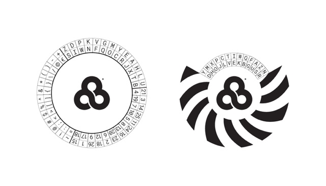

# Translator

This application (live at [THIS LINK](https://tedcart.github.io/bonnie-trans/)) translates and decodes messages based on a character substitution method.

Building the numbers messages is a little more complicated - maybe avoid punctuation in numbers messages.

# Decoder for reference

